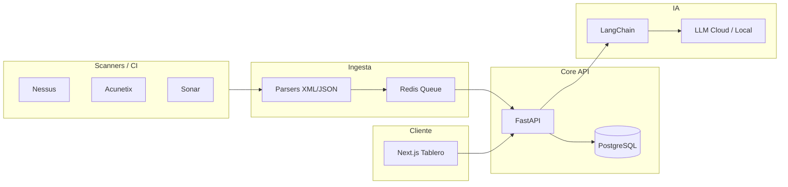

# Documento de Arquitectura Técnica (TAD) — Spectra SecOps

## 1. Objetivo

Plataforma para **gestión de vulnerabilidades**, **ciclo de vida de pentest** y **servicios de ciberseguridad**, con **IA asistida** (LangChain) bajo revisión humana, auditable y escalable por microservicios.

## 2. Vista lógica (microservicios)

| Servicio | Responsabilidad | Tecnología propuesta |
|----------|-----------------|----------------------|
| **Web / BFF** | Tablero, flujos UX, exportaciones cliente | Next.js (App Router) |
| **API Core** | CRUD hallazgos, activos, engagements, planes | FastAPI + SQLAlchemy |
| **Ingesta** | Parsers Nessus/Acunetix/Sonar, normalización | Workers Python + colas |
| **IA** | Enriquecimiento, deduplicación, CVSS asistido | LangChain + proveedores LLM |
| **Caché / colas** | Rate limits, jobs async, sesiones | Redis |

Los servicios se despliegan de forma independiente; el repositorio actual agrupa **frontend** y **API** como monorepo de arranque, listo para dividir en imágenes Docker por servicio.

## 3. Flujo de datos (alto nivel)

## 4. Stack tecnológico

- **Frontend:** Next.js 16, React 19, Tailwind, componentes UI existentes.
- **Backend:** Python 3.12+, FastAPI, Uvicorn.
- **Datos:** PostgreSQL 16 (hallazgos, inventario, engagements), Redis 7 (caché/colas).
- **IA:** `langchain-core`, `langchain-openai`, `langchain-anthropic` (extensible a Ollama/Llama).

## 5. Seguridad y cumplimiento

- Secretos solo por variables de entorno; nunca en el cliente.
- Salida de informes: trazabilidad de **quién validó** texto generado por IA (campo/capa de auditoría a añadir en evolución).
- Separación de entornos (Prod/Dev) en activos y políticas de retención por engagement.

## 6. Despliegue local

1. `docker compose up -d` (PostgreSQL + Redis).
2. Backend: `cd backend && python -m venv .venv && source .venv/bin/activate && pip install -r requirements.txt && cp .env.example .env && uvicorn app.main:app --reload --port 8000`.
3. Frontend: `npm install && npm run dev`.

## 7. Evolución prevista

- Servicio de ingesta dedicado + esquema de **deduplicación** por hash/fingerprint.
- API Gateway (Kong/Traefik) y autenticación OIDC.
- Motor de reportes PDF/HTML asíncrono.
